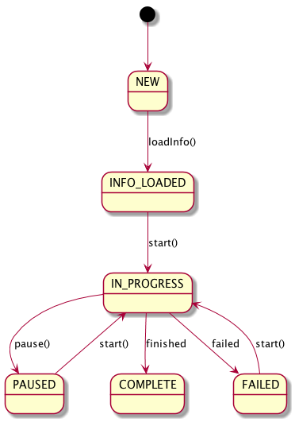
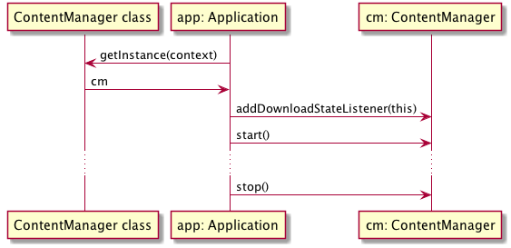
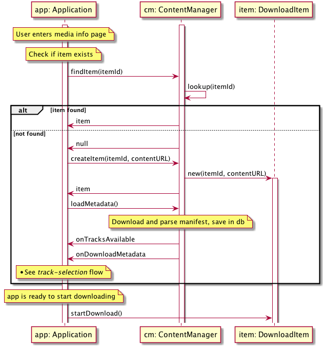
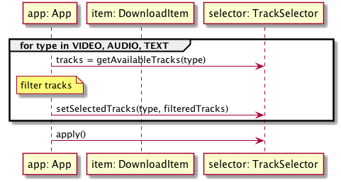

# Download-to-Go for Android

Download to Go (DTG) is an Android library that facilitates the download of video assets, with an emphasis on DASH and HLS.

## Supported Video Formats  

- MPEG-DASH
    - Clear and Widevine
    - Currently only streams generated by Kaltura MediaPrep are supported
    - Track selection
- HLS
    - Clear only
    - No track selection
- Widevine Classic
    - Must be single-bitrate for proper playback
- MP4

## Project Setup  

dependencies {
	compile 'com.kaltura.dtg:dtglib:2.1.1'
}

Replace `2.1.1` with the [latest release](https://github.com/kaltura/playkit-dtg-android/releases).

## Download States



## Usage  

The following classes/interfaces are the public API of the library:

```
    com.kaltura.dtg.
        - ContentManager
        - DownloadItem
        - DownloadState
        - DownloadStateListener
```
 
Please see their Javadoc comments.

Following are some basic sequence diagrams.

### Start and Stop the Service  



### New Download Sequence  



## Track Selection  

Tracks are selected, by type, using a TrackSelector object. A TrackSelector is obtained by calling `getTrackSelector()` on a DownloadItem.
Given a TrackSelector, the application performs selection:

```java
List<DownloadItem.Track> tracks = trackSelector.getAvailableTracks(AUDIO);
// Application logic for track filtering.
trackSelector.setSelectedTracks(AUDIO, filteredTracks)
// Repeat for other track types (VIDEO, TEXT)

trackSelector.apply();
```

### Sequence Diagram  



### Interactive Selection Before Download is Started  

In this scenario, the metadata for an item was downloaded, the default tracks were selected, but the download wasn't yet started. 
The application calls item.getTrackSelector(), makes a selection and applies it. The selected tracks are downloaded as part of the normal download.


### Interactive Selection After Download is Finished  

The entire item has downloaded. The user now decides to download additional tracks - such as another audio language. 
The application calls item.getTrackSelector(), makes a selection and applies it. Then, item.startDownload() is called again, to start downloading the extra tracks.

### Preference-based Selection  

The application may have a policy on track selection, for example:
- Always choose the highest quality video
- Always prefer audio in the user's UI language

The ContentManager calls the application's listener method onTracksAvailable() with an open TrackSelector. The application selects tracks to download and **when onTracksAvailable() returns**, the selection is applied.

If no selection was made, some defaults are applied instead. However, it's recommended that the application adopts its own defaults.

If the application can select tracks without user interaction, it is best to do so inside the onTracksAvailable() handler. It avoids writing data to the database that will be discarded immediately after.

### Track Selection Samples  

Select the video track with the **lowest** bitrate:

```java
    List<DownloadItem.Track> videoTracks = trackSelector.getAvailableTracks(DownloadItem.TrackType.VIDEO);
    DownloadItem.Track minVideo = Collections.min(videoTracks, DownloadItem.Track.bitrateComparator);
    trackSelector.setSelectedTracks(DownloadItem.TrackType.VIDEO, Collections.singletonList(minVideo));
```

Select all available tracks:

```java
    void selectAllAvailableTracksByType(DownloadItem.TrackSelector trackSelector, DownloadItem.TrackType trackType) {
        List<DownloadItem.Track> availableTracks = trackSelector.getAvailableTracks(trackType);
        trackSelector.setSelectedTracks(trackType, availableTracks);
    }
```

Then, from onAvailableTracks():

```java
    selectAllAvailableTracksByType(trackSelector, DownloadItem.TrackType.AUDIO);
    selectAllAvailableTracksByType(trackSelector, DownloadItem.TrackType.TEXT);
```

### Default Selection  

- Video: highest bitrate track
- Audio: highest bitrate version of the first language
- Text: first track.

